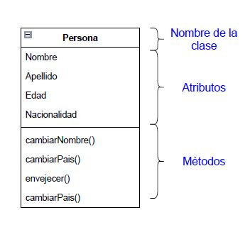
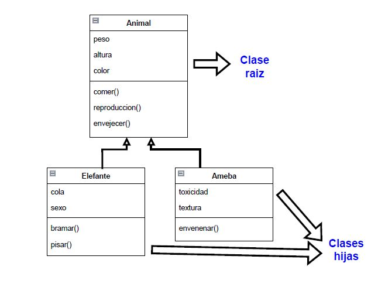

## CLASES

Una **clase** esta compuesta de **atributos** y **métodos**.

- Los **atributos** son las distintas propiedades que poseen las clases.
- Los **métodos** son acciones que podrá realizar nuestra clases.

Un ejemplo de clase **persona** sería:

Las clases tienen cuatro paradigmas principales:

1. **Abstraccio de datos** Es lo que nos definiría el objeto más alla de características externas, podríamos definirlo como el concepto en sí mismo.

2. **Encapsulacion** Cada objeto puede tener una informacion definida propieamente para dicho objeto. Solo se puede acceder a los datos del objeto, dentro del propio objeto.

3. **Herencia** Algunas clases pueden estar relaccionadas de forma que una sera la raiz y las siguientes colgaran de ella. Por ejemplo, una clase animal y otra clase elefante, donde la clase animal sería la raíz y el elefante sería dependiente de ella.

4. **Polimorfismo** La propiedad por la que los métodos de la clase raíz pueden ser a su vez redefinida por las clases de las que heredan para adaptarse a cada una de ellas.

Las clases serían un tipo abastracto de objetos:
Como vemos en  python al crear una variable la esta creando como una clase abstracta.

Al crar las clases podremos definirlas y decirles si heredan de otras, y a su vez definir que atributos internos tendrán y los métodos propios de la clase.